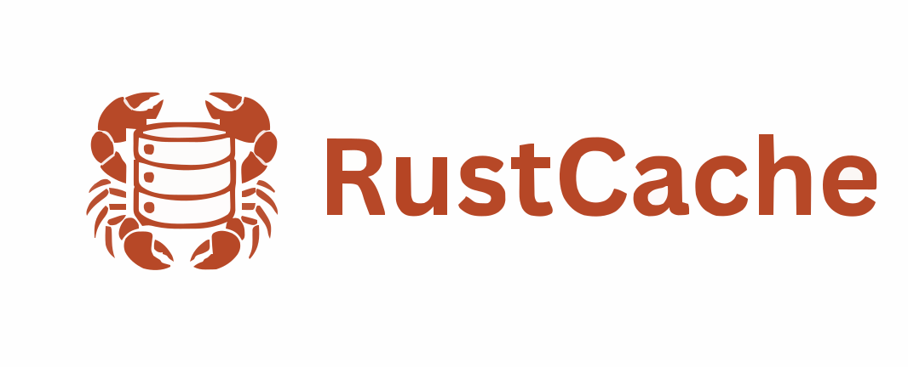

<p align="center">
  
</p>
<p align="center">
    <em>A fast, safe key-value store in Rust</em>
</p>

---

**Documentation**: <a href="" target="_blank"> TBD </a>

---

A lightweight **Key-Value Data Store** built in Rust.  
Designed for speed, safety, and modern multi-core systems.

## 🚀 Why rustcache?
- **Safe Concurrency** – Rust’s ownership model enables fearless multi-threading without data races.  
- **Multi-core Scaling** – Async runtimes (Tokio/async-std) allow natural scaling across CPU cores.  
- **Zero-cost Abstractions** – High-level Rust features compile down to efficient machine code with no runtime penalty.  
- **Cache-friendly Design** – Optimized for predictable performance under heavy workloads.  

## Features
- In-memory key-value storage
- Async + multi-threaded ready
- Extendable for custom data structures
- Memory-safe and crash-resistant

## Getting Started
```bash
git clone https://github.com/ForgeOfCreationX/RustCache.git
cd RustCache
cargo run
```

